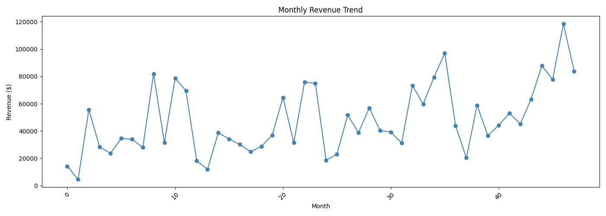
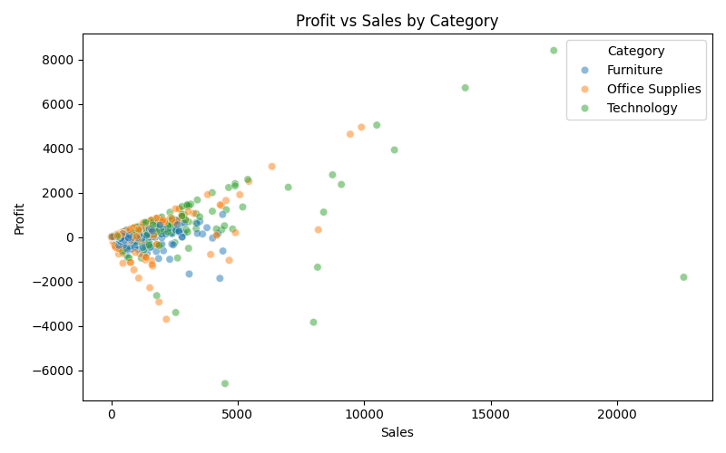
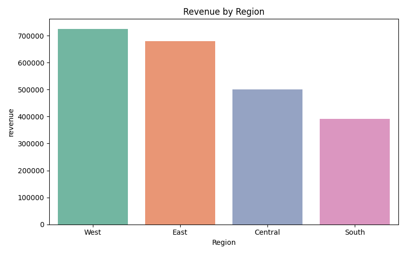
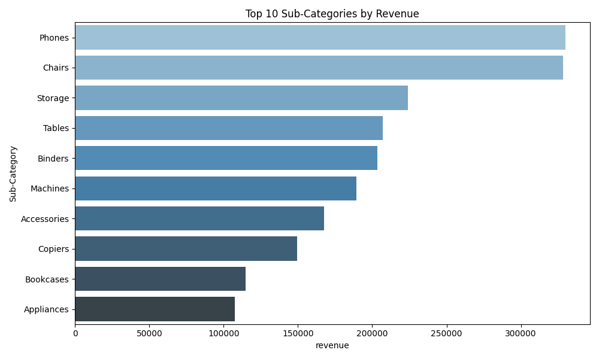
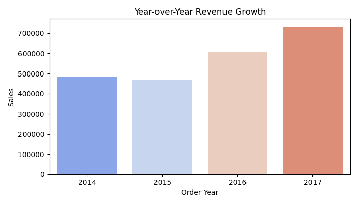

# Sales Trend Analytics Dashboard

## Project Overview

This project focuses on analyzing retail sales data to uncover key business insights using Python-based data analytics and visualization techniques.

The goal is to simulate a real-world business scenario where data is transformed into actionable insights for decision-making.

---

## Objectives

* Analyze sales performance over time
* Identify top-performing product categories
* Evaluate regional revenue distribution
* Understand profitability trends
* Measure year-over-year growth

---

## Tech Stack

* Programming: Python
* Libraries: Pandas, NumPy, Matplotlib, Seaborn
* Tools: Jupyter Notebook / VS Code
* Data Source: CSV-based retail sales dataset

---

## Project Structure

```
sales-trend-analytics/
│── data/
│   └── sales_data.csv
│── notebooks/
│   └── sales_analysis.ipynb
│── outputs/
│   ├── monthly_revenue_trend.png
│   ├── profit_vs_sales.png
│   ├── regional_revenue.png
│   ├── top_subcategories.png
│   └── yoy_growth.png
│── requirements.txt
│── README.md
```

---

## Data Pipeline

1. Data Ingestion

   * Loaded dataset using Pandas

2. Data Cleaning

   * Handled missing values
   * Removed duplicates
   * Standardized column formats

3. Data Transformation

   * Feature engineering (Month, Year, Categories)
   * Aggregations using groupby

4. Exploratory Data Analysis (EDA)

   * Identified trends and patterns
   * Compared categories and regions

5. Visualization

   * Created multiple business-focused charts

---

## Key Insights

### Monthly Revenue Trends

* Revenue shows seasonal fluctuations
* Significant spikes indicate high-demand periods

### Profit vs Sales

* Positive correlation between sales and profit
* Some high-sales transactions show negative profit (loss cases)

### Regional Performance

* West region generates highest revenue
* South region underperforms compared to others

### Top Sub-Categories

* Phones and Chairs are top revenue drivers
* Accessories and Appliances show lower contribution

### Year-over-Year Growth

* Strong growth observed from 2015 to 2017
* Indicates improving business performance

---

## Visualizations

### Monthly Revenue Trend



### Profit vs Sales by Category



### Revenue by Region



### Top Sub-Categories



### Year-over-Year Growth



---

## Business Impact

* Helps stakeholders identify high-performing regions and products
* Detects loss-making transactions
* Supports data-driven strategic planning
* Enables better inventory and sales forecasting

---

## Installation and Setup

### 1. Clone the repository

```
git clone https://github.com/nvarshi2004/sales-trend-analytics-dashboard.git
cd sales-trend-analytics
```

### 2. Install dependencies

```
pip install -r requirements.txt
```

### 3. Run the notebook

```
jupyter notebook
```

---

## requirements.txt

Create a file named `requirements.txt` and add:

```
pandas
numpy
matplotlib
seaborn
jupyter
```

---

## Future Improvements

* Build an interactive dashboard (Streamlit / Power BI)
* Add predictive analytics (sales forecasting)
* Deploy as a web application
* Automate data pipeline

---

## Author

Varshith Nuggu
LinkedIn: https://www.linkedin.com/in/varshithnuggu
Email: [varshithnuggunv@gmail.com](mailto:varshithnuggunv@gmail.com)

---

## License

This project is open-source and available under the MIT License.
